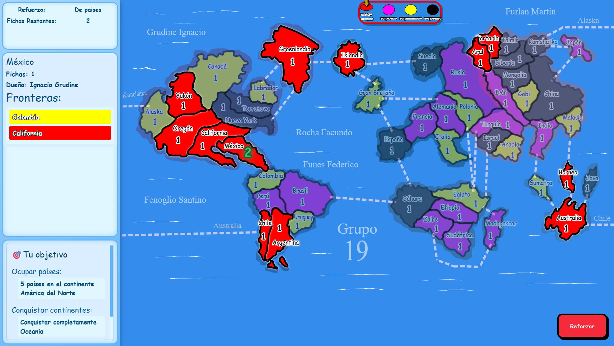

# T.E.G

Proyecto T.E.G. - Versión Digital

Este proyecto es una implementación digital del clásico juego de mesa **T.E.G. (Táctica y Estrategia de Guerra)**, desarrollado como Trabajo Práctico Integrador en la facultad, utilizando un stack **full stack moderno** con pruebas unitarias e integraciones automatizadas.

## Descripción General

El sistema permite a los usuarios disfrutar de una experiencia de T.E.G. digital con varias funcionalidades, manteniendo la esencia del juego:

- **Jugar en distintos navegadores desde la misma computadora**
- **Partidas contra bots** con inteligencia artificial básica
- **Conquistar territorios y cumplir objetivos**
- **Sistema de tarjetas y refuerzos**
- **Estadísticas de partidas**, incluyendo resultados y desempeño de jugadores
- **Configuración de partidas privadas y públicas**, definiendo reglas y objetivos

## Funcionalidades Destacadas

1. **Juego Multijugador y contra Bots**: Jugar con amigos en distintos navegadores o contra bots con estrategias básicas de ataque y defensa.
2. **Gestión de Partidas**: Crear, unirse y configurar partidas públicas o privadas, con distintos objetivos y condiciones de victoria.
3. **Sistema de Refuerzos y Cartas**: Al conquistar territorios, se obtienen tarjetas que pueden canjearse por refuerzos estratégicos.
4. **Estadísticas de Partidas**: Registro de resultados y desempeño, útil para analizar estrategias y mejorar el juego.
5. **Backend Robusto**: Implementado en **Java + Spring**, con pruebas unitarias e integraciones usando **JUnit** y **Mockito**, asegurando la correcta lógica de juego y persistencia de datos.
6. **Frontend Interactivo**: **Angular + TypeScript** permite una experiencia de usuario fluida, con visualización del mapa, territorios y movimientos en tiempo real.
7. **API y Documentación**: **Postman** y **Swagger** se usan para probar y documentar la API, facilitando la integración y testing.
8. **Base de Datos**: **PostgreSQL** para persistencia confiable de usuarios, partidas, estadísticas y configuraciones de juego.

## Tecnologías Utilizadas

- **Frontend:** Angular, TypeScript
- **Backend:** Java, Spring Boot
- **Testing:** JUnit, Mockito
- **Base de Datos:** PostgreSQL
- **API Testing y Documentación:** Postman, Swagger

## Objetivo del Proyecto

El objetivo fue **desarrollar una versión digital del T.E.G.** aplicando buenas prácticas de desarrollo full stack, pruebas automatizadas y diseño de una arquitectura escalable, que permita agregar nuevas funcionalidades fácilmente en el futuro.

---

